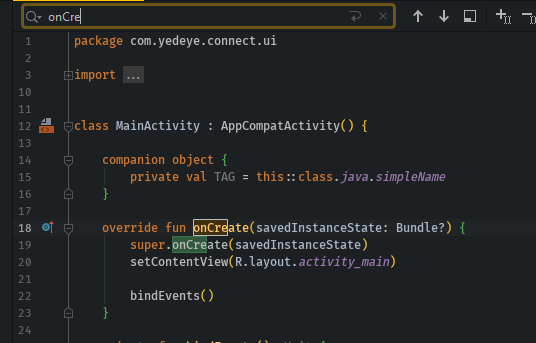
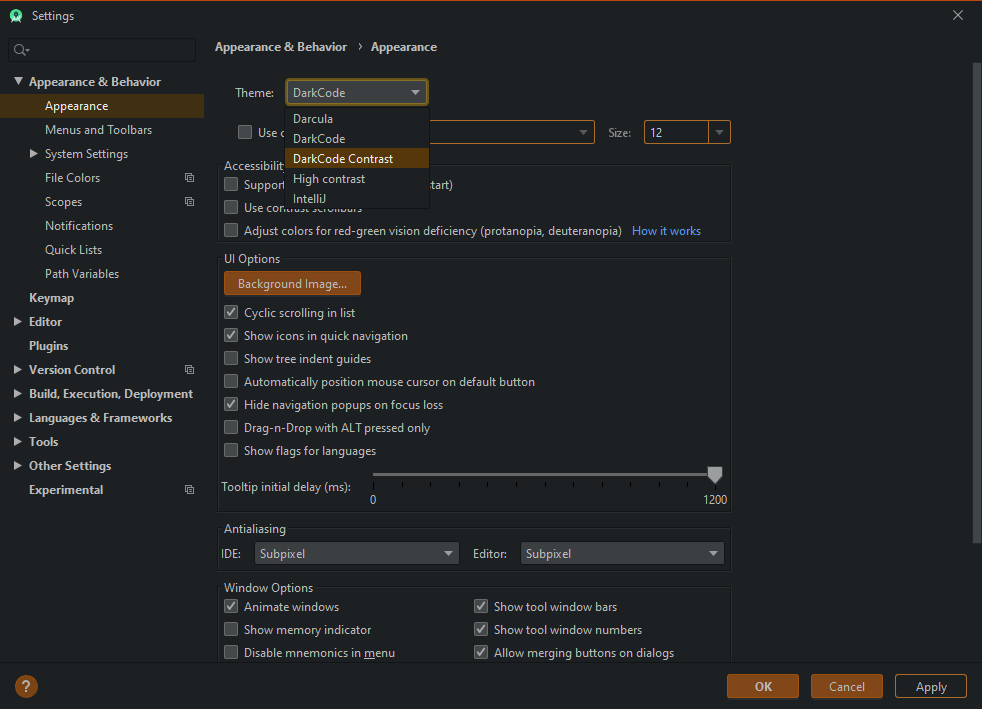

# 🖤 DarkCode-Theme-JB
つ ◕_◕ つ Dark theme for cool "JetBrains" coders

> 💱 Converted version of [DarkCode Theme](https://marketplace.visualstudio.com/items?itemName=yedhrab.darkcode-theme-adopted-python-and-markdown)

## 🤳 Screenshots

	  
	  
	  
	  
	  
	  
</dev>

## 💖 Destek ve İletişim

​[​​](https://github.com/yedhrab) [​​](https://www.linkedin.com/in/yemreak/) [​​](https://yemreak.com/) [​​](mailto:yemreak.com@gmail.com?subject=DarkCode-Theme-JB%20%7C%20GitHub)​

​[​](https://www.patreon.com/yemreak/)

## 🔏 Lisans

**The** [**Apache 2.0 License**](https://choosealicense.com/licenses/apache-2.0/) **©️ Yunus Emre Ak**

